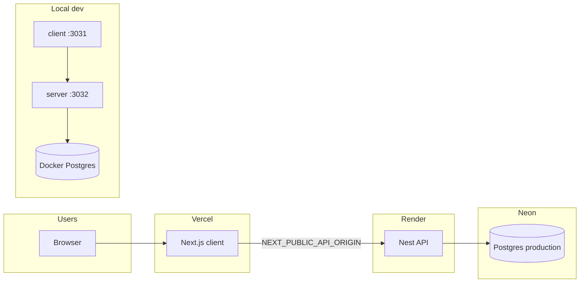

# Deployment

Hyreefy ships as two app repos plus shared product docs:

| Repo | Host | Trigger |
|------|------|---------|
| `client/` | [Vercel](https://vercel.com) | Push to connected branch (e.g. `main`) |
| `server/` | [Render](https://render.com) | Push to connected branch |
| Database (production) | [Neon](https://neon.tech) | Schema via Render **pre-deploy** migrate; optional `neon deploy` for Neon platform config |

**Environment variables:** [setup-environment.md](./setup-environment.md)  
**Stack-specific detail (Neon, Render, Vercel, CI):** [architecture/server/deployment-render-neon.md](./architecture/server/deployment-render-neon.md)

Future AWS target (not current default): [architecture/server/deployment-aws.md](./architecture/server/deployment-aws.md).

## Architecture (current)

## First-time hosted setup checklist

1. **Neon** — Production branch exists; Drizzle migrations applied (see server doc). Project id in repo: `jolly-resonance-29162110`, branch `production`.
2. **Render** — Web Service from `server/` repo; sync `render.yaml` or mirror its build/start/pre-deploy commands.
3. **Render env** — `DATABASE_URL`, `DATABASE_URL_UNPOOLED`, `AUTH_SECRET`, `CORS_ORIGIN`, `NODE_ENV`, `PORT` ([setup-environment.md](./setup-environment.md#server-render)).
4. **Vercel** — Project from `client/` repo; set client env vars including `NEXT_PUBLIC_API_ORIGIN` → Render URL.
5. **GitHub** — Push `.github/workflows/ci.yml` in both repos so PRs run lint/tests.

## Isolated test domain (tenant onboarding)

For multi-tenant signup testing on an **unused apex domain** (not production main), use a **separate** Vercel project, API service, and Neon branch. Configure wildcard DNS on Cloudflare and env-driven `APP_BASE_DOMAIN` — no domain literals in code. Full procedure: [architecture/test-environment-onboarding.md](./architecture/test-environment-onboarding.md).
6. **Smoke test** — `GET {API}/api/v1/health` → `{ "status": "ok" }`; open Vercel URL and log in.

## What runs on each deploy

### Client (Vercel)

- Install dependencies → `next build` → deploy static/server output.
- No database; reads `NEXT_PUBLIC_*` and server-side env at build/runtime.

### Server (Render)

1. **Build:** `npm ci --legacy-peer-deps && npm run build`
2. **Pre-deploy:** `npm run db:migrate` (uses `DATABASE_URL_UNPOOLED` when set — see `drizzle.config.ts`)
3. **Start:** `npm run start:prod` → listens on `PORT` (default `10000` on Render)

Health check path: `/api/v1/health`.

### Database (Neon)

- **Runtime:** API uses pooled `DATABASE_URL`.
- **Migrations:** Drizzle via unpooled URL on each Render deploy (and locally via `npm run db:migrate:neon` when needed).
- **Neon IaC:** `server/neon.ts` + `neon deploy` for Neon platform settings (not a substitute for Drizzle SQL migrations).

## CI (GitHub Actions)

| Workflow | Runs |
|----------|------|
| `server/.github/workflows/ci.yml` | oxlint, unit tests, e2e with service Postgres, migrations |
| `client/.github/workflows/ci.yml` | eslint, unit tests, production build |

CI does not deploy and does not need production secrets.

## Local vs production

| Concern | Local | Production |
|---------|-------|------------|
| Postgres | Docker (`server/docker-compose.yml`) | Neon branch `production` |
| Server env file | `server/.env` | Render dashboard |
| Client env file | `client/.env.local` | Vercel dashboard |
| Deploy | `start:dev` / `next dev` | Git push → Vercel + Render |

Do **not** point `server/.env` at Neon for everyday development.

## Related docs

- [setup-environment.md](./setup-environment.md) — copy/paste env tables and troubleshooting
- [architecture/server/deployment-render-neon.md](./architecture/server/deployment-render-neon.md) — Neon CLI link, `render.yaml`, CI notes
- [architecture/server/overview.md](./architecture/server/overview.md) — API conventions and modules
- `server/README.md` / `client/README.md` — quick start commands
