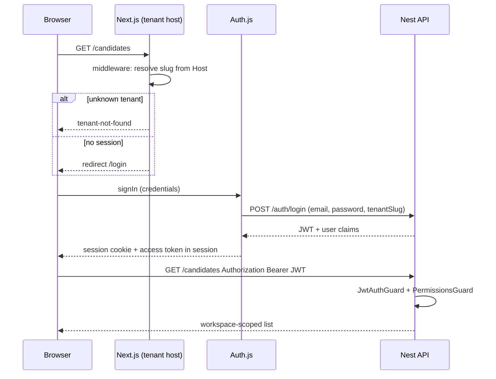

# Sprint 1 — development guide

**Sprint:** `sprint-1` (2026-09-28 → 2026-10-11)  
**Trackers:** [`client/current.yaml`](./client/current.yaml) · [`server/current.yaml`](./server/current.yaml)  
**Goal:** Tenant-scoped **auth** (STEP 1.5) then **RBAC** (STEP 1.6). No `(dashboard)` shell until both slices are done.

Feature specs: [auth.md](../features/auth.md), [rbac.md](../features/rbac.md). Architecture: [multi-tenancy.md](../architecture/multi-tenancy.md), [permissions.md](../architecture/permissions.md).

---

## Scope summary

| In sprint 1 | Out of sprint 1 (next sprints) |
|-------------|--------------------------------|
| Login + session on tenant subdomain | `(dashboard)` layout, overview, sidebar |
| Tenant-not-found / session-expired UX | Jobs, JD, ATS, profile, workflows |
| JWT on Nest; protect `GET /candidates` | Meetings, AI analyzers, analytics |
| Tenants, workspaces, users, RBAC schema + seed | Workspace settings UI (STEP 3) |
| `permissions[]` in JWT; `PermissionsGuard` | Member invite flows |
| Client bearer fetchers + `<Can>` foundation | Replace spike `/` and `/candidates` with dashboard routes |

**End state for sprint 1:** Recruiter opens `http://acme.localhost:3000`, signs in, calls the API with a bearer token, and sees only **acme** workspace candidates. A user without `candidates.read` gets **403** from the API; UI can show [NoAccess](../features/rbac.md) patterns before shell ships.

---

## How many routes?

### Sprint 1 — pages and handlers to build

| # | URL (on tenant host) | App Router path | Type | Notes |
|---|----------------------|-----------------|------|--------|
| 1 | `/login` | `(auth)/login/page.tsx` | UI | No dashboard chrome; mockups: `designs/screens/Login*.html` |
| 2 | `/tenant-not-found` (or equivalent) | `(public)/tenant-not-found/page.tsx` or middleware rewrite | UI | Unknown subdomain; `TenantNotFound.html` |
| 3 | `/api/auth/*` | `api/auth/[...nextauth]/route.ts` | API route | Auth.js handler |
| 4 | *(optional v1)* `/register` | `(auth)/register/page.tsx` | UI | Non-goal in auth spec unless explicitly added |

**Sprint 1 user-facing pages: 2 required (+ 1 optional register).**  
**Next.js route handlers: 1** (Auth.js).

**Spike pages (exist today — keep until STEP 2, then remove or redirect):**

| URL | Path today | Sprint 1 behavior |
|-----|------------|-------------------|
| `/` | `app/page.tsx` | Middleware: unauthenticated → `/login`; authenticated may stay spike or redirect to a minimal post-login view |
| `/candidates` | `app/candidates/page.tsx` | Same; wired to API with bearer after `task-auth-api-bearer` |

No new product routes beyond auth/edge cases in this sprint.

### Full product — route inventory (after roadmap)

Target tree: [folder-structure.md](../architecture/folder-structure.md). Counts below are **distinct `page.tsx` URLs** under `(dashboard)` plus auth; job tabs are per `jobId`.

| Area | Routes | Paths |
|------|--------|--------|
| Auth | 1–2 | `/login`, optional `/register` |
| Overview | 1 | `/overview` |
| Jobs | 2 + 10 tabs | `/jobs`, `/jobs/new`, `/jobs/[jobId]/{overview,jd,candidates,pipeline,assessments,interviews,emails,automation,analytics,settings}` |
| Candidates | 2 | `/candidates`, `/candidates/[candidateId]` |
| Top-level product | 6 | `/pipeline`, `/assessments`, `/interviews`, `/analytics`, `/automations`, `/emails` |
| Settings | 1 + ~4–6 children | `/settings`, `/settings/analyzers`, members/company/culture/roles (workspace spec) |
| Edge | 1–2 | Tenant-not-found, in-app no-access |

**Approximate full product: ~30–35 recruiter `page.tsx` routes** (plus Auth.js API handler). Exact settings sub-routes land with [workspace.md](../features/workspace.md) and [ai-skill-analyzers.md](../features/ai-skill-analyzers.md).

---

## Request flows

### Login and API access



### Tenant resolution (client)

```text
Host: acme.localhost:3000
  → tenantSlug = "acme"
  → middleware blocks if slug not in known set (or tenant lookup fails)
  → login and session carry tenantId + workspaceId from server
```

---

## Server API (Sprint 1)

Base path: `/api/v1` ([overview.md](../architecture/server/overview.md)). Default port **3001**.

### Today (implemented)

| Method | Path | Auth | Purpose |
|--------|------|------|---------|
| GET | `/health` | Public | Liveness `{ status: "ok" }` |
| POST | `/auth/login` | Public | Email + password + `tenantSlug` → JWT. `permissions` comes from the workspace role |
| GET | `/candidates` | Bearer | List candidates where `workspace_id = token.workspaceId`; requires `candidates.read` |

### Target by end of sprint 1

| Method | Path | Auth | Permission | Purpose |
|--------|------|------|------------|---------|
| GET | `/health` | Public | — | Unchanged |
| POST | `/auth/login` | Public | — | Email + password + `tenantSlug` → JWT; 401 generic failure |
| GET | `/auth/session` | Bearer | — | Optional: refresh claims for Auth.js (if not embedding all fields in login response) |
| GET | `/candidates` | Bearer | `candidates.read` | List candidates where `workspace_id = token.workspaceId` |

**Error contract (consistent across protected routes):**

| Status | When |
|--------|------|
| 401 | Missing/invalid/expired JWT |
| 403 | Valid JWT but missing permission or wrong workspace context |

**Zod:** Request/response shapes in `server/src/domains/auth/*.schemas.ts`, `candidate.schemas.ts` (extend list response if needed).

**Modules to add:**

```text
server/src/domains/auth/     # login, JwtStrategy, JwtAuthGuard, @Public()
server/src/domains/rbac/     # PermissionsGuard, @RequirePermission()
```

`CandidatesController` applies guards globally or per-route; health stays `@Public()`.

### Login request/response (contract)

**Request** `POST /api/v1/auth/login`

```json
{
  "email": "recruiter@acme.example",
  "password": "string",
  "tenantSlug": "acme"
}
```

`tenantSlug` must match the tenant the user is signing into (Auth.js passes slug from Host).

**Response** `200`

```json
{
  "accessToken": "<jwt>",
  "tokenType": "Bearer",
  "expiresIn": 3600,
  "user": {
    "id": "uuid",
    "email": "recruiter@acme.example",
    "name": "string"
  },
  "tenant": {
    "id": "uuid",
    "slug": "acme"
  },
  "workspace": {
    "id": "uuid",
    "name": "Acme"
  },
  "permissions": [
    "analytics.read",
    "assessments.assign",
    "billing.manage",
    "candidates.edit",
    "candidates.read",
    "candidates.reject",
    "interviews.schedule",
    "jobs.create",
    "jobs.edit",
    "jobs.read",
    "settings.manage"
  ]
}
```

That array is the seeded **admin** role (acme and beta recruiters). The seeded interviewer role is `["interviews.schedule"]` and does not include `candidates.read`.

**JWT claims** (validated by Nest; mirrored in Auth.js session):

| Claim | Type | Use |
|-------|------|-----|
| `sub` | uuid | User id |
| `tenantId` | uuid | Isolation |
| `tenantSlug` | string | Debugging / client display |
| `workspaceId` | uuid | All domain queries |
| `permissions` | string[] | RBAC guard |

Signing: shared `AUTH_SECRET` with Auth.js ([ADR 003](../adr/003-auth-js-session.md)).

---

## Database (Sprint 1)

**ORM:** Drizzle · **Migrations:** `server/drizzle/` · **Seed:** `server` db seed script (extend for sprint).

### Today

| Table | Columns (summary) | Tenancy |
|-------|-------------------|---------|
| `tenants` | `id`, `slug` unique, `name`, `status`, timestamps | Customer org |
| `workspaces` | `id`, `tenant_id` unique, `name`, timestamps | One primary workspace per tenant |
| `users` | `id`, `email` unique, `name`, `password_hash`, timestamps | Identity |
| `workspace_members` | `user_id`, `workspace_id`, `role_id` unique pair | Membership plus workspace role |
| `candidates` | `id`, `workspace_id` NOT NULL, `name`, `role`, `stage`, timestamps | Scoped to workspace |

### Target schema (new + alter)

| Table | Purpose | Key columns / constraints |
|-------|---------|---------------------------|
| `tenants` | Customer org | `id`, `slug` UNIQUE, `name`, `status`, timestamps |
| `workspaces` | Hiring container | `id`, `tenant_id` FK → `tenants`, `name`, … |
| `users` | Identity | `id`, `email` UNIQUE, `name`, `password_hash`, timestamps |
| `workspace_members` | Membership | `user_id`, `workspace_id`, `role_id`, UNIQUE(user, workspace) |
| `roles` | Named role per workspace or tenant template | `id`, `workspace_id` (or tenant-scoped template), `name` |
| `permissions` | Stable keys | `id`, `key` UNIQUE (`candidates.read`, …) |
| `role_permissions` | M2M | `role_id`, `permission_id` |
| `candidates` | **Alter** | Add `workspace_id` FK NOT NULL; backfill dev seed per tenant |

**Auth migration (`drizzle/0000_*.sql`):** creates `tenants`, `workspaces`, `users`, `workspace_members` (`user_id` + `workspace_id` only), and `candidates.workspace_id` NOT NULL. RBAC adds `roles`, `permissions`, `role_permissions`, and `workspace_members.role_id`.

**Dev seed (minimum):**

- Tenants: `acme`, `beta` (distinct slugs).
- One primary workspace per tenant.
- Users: `recruiter@acme.example` and `recruiter@beta.example` (admin); `interviewer@acme.example` (interviewer). Password `dev-password`.
- Roles: `admin` (full catalog, including `candidates.read`) and `interviewer` (`interviews.schedule` only) on each dev workspace.
- Candidates: rows partitioned by `workspace_id` so list APIs prove isolation.

**Migration strategy:** One or more Drizzle migrations in sprint tasks `task-tenant-schema` and `task-rbac-schema`; never ship new protected APIs without workspace scoping on data.

---

## Client implementation map (Sprint 1)

| Piece | Path | Task |
|-------|------|------|
| Auth.js config | `client/src/auth.ts` | `task-auth-authjs` |
| Route handler | `client/src/app/api/auth/[...nextauth]/route.ts` | `task-auth-authjs` |
| Login page | `client/src/app/(auth)/login/page.tsx` | `task-auth-authjs` |
| Middleware | `client/src/middleware.ts` | `task-auth-authjs` |
| Tenant helpers | `client/src/lib/tenant/` | `task-auth-authjs` |
| Session / token | `client/src/lib/auth/session.ts` | `task-auth-api-bearer` |
| API client | Domain fetchers (e.g. `candidates`) attach `Authorization` | `task-auth-api-bearer` |
| Permissions | `client/src/shared/permissions/` | `task-rbac-client` |
| `<Can>` / hooks | `can.tsx`, `use-permissions.ts` | `task-rbac-client` |

**i18n:** `messages/*` — `Auth` namespace for login strings.

**Env (client `.env.local`):** `AUTH_SECRET`, `AUTH_URL` (per-tenant host in dev), `APP_BASE_DOMAIN`, `NEXT_PUBLIC_API_URL` (or existing candidates API env).

**Env (server `.env`):** `AUTH_SECRET`, `DATABASE_URL`, `CORS_ORIGIN` (tenant subdomains), `PORT`.

---

## Paired tasks (client ↔ server)

Implement in order; update both YAML files when a row is done.

| Order | Server (`server/current.yaml`) | Client (`client/current.yaml`) |
|-------|-------------------------------|--------------------------------|
| 1 | `task-tenant-schema` | *(none — server-first)* |
| 2 | `task-auth-jwt-guard` + `task-auth-dev-user` | `task-auth-authjs` |
| 3 | `task-rbac-schema` | `task-rbac-catalog` |
| 4 | `task-rbac-guard` + `task-rbac-jwt-claims` | `task-rbac-client` + `task-auth-api-bearer` |
| 5 | `task-rbac-server` (candidates 403 tests) | `task-rbac-server` (pair) |

Do not mark client auth **done** until Nest login + JWT validation works with the same secret and tenant seed users exist.

---

## Tests (Sprint 1) — mandatory

Policy: [`delivery-tests-and-progress.mdc`](../.cursor/rules/delivery-tests-and-progress.mdc). Check off rows in [`sprint-1-progress-checklist.md`](./sprint-1-progress-checklist.md).

| Layer | What to prove |
|-------|----------------|
| Server unit | Login rejects wrong tenant; JWT guard; permission matrix role → keys |
| Server e2e | `POST /auth/login`; `GET /candidates` 401 without token; 403 without `candidates.read`; 200 scoped to workspace |
| Client unit | Token attachment helper; `usePermissions` / `<Can>` with mock session |
| Client e2e | Login on `acme.localhost`; list candidates; deny on `beta.localhost` without membership (when harness + seed ready) |

Sprint YAML tasks: `task-auth-api-tests`, `task-auth-client-tests`, `task-rbac-api-tests`, `task-rbac-client-tests`.

---

## Definition of done (sprint 1)

Aligned with [auth.md](../features/auth.md) and [rbac.md](../features/rbac.md) acceptance criteria:

- [ ] Two dev tenants seeded; candidates scoped by `workspace_id`
- [ ] Login only on known subdomain; unknown → tenant-not-found
- [ ] Protected `GET /candidates` requires bearer + `candidates.read`
- [ ] Session exposes `tenantId`, `workspaceId`, `permissions[]` for client hooks
- [ ] `<Can>` and `usePermissions()` merged before starting STEP 2 `(dashboard)` layout
- [ ] Sprint YAML progress updated; spike pages either behind auth or documented redirect plan for STEP 2

---

## Progress tracking

- **Weighted %:** `sprint/client/current.yaml` and `sprint/server/current.yaml` → `progress.sprint_percent`
- **Checkbox burndown:** [`sprint-1-progress-checklist.md`](./sprint-1-progress-checklist.md) (implementation + test lines; update summary table when checking items)

## References

- [delivery-tests-and-progress.mdc](../.cursor/rules/delivery-tests-and-progress.mdc)
- [product-delivery-principles.mdc](../.cursor/rules/product-delivery-principles.mdc)
- [domains/server/auth/README.md](../domains/server/auth/README.md)
- [domains/server/rbac/README.md](../domains/server/rbac/README.md)
- [roadmap/frontend.md](../roadmap/frontend.md) — STEP 2+ route work
- [routing-and-shell.md](../architecture/routing-and-shell.md) — shell after this sprint
